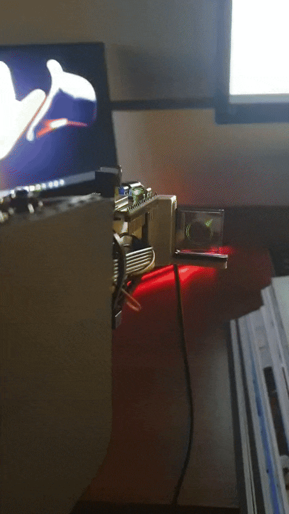
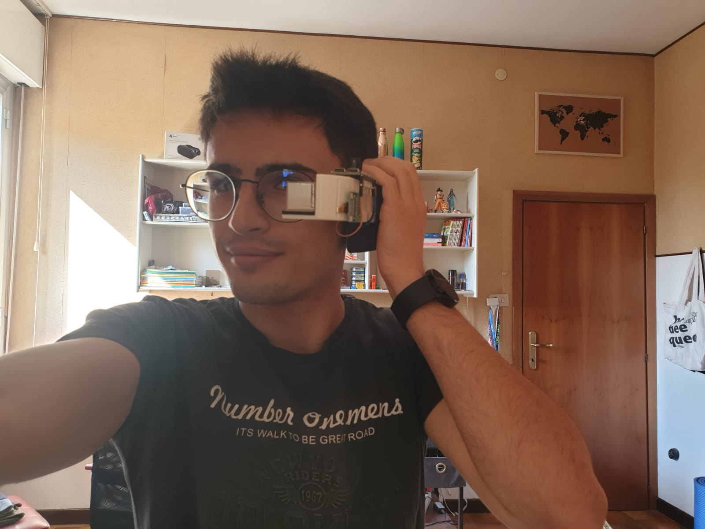
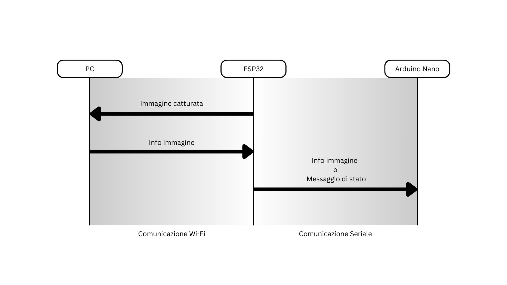
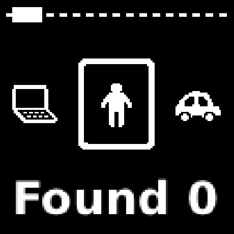
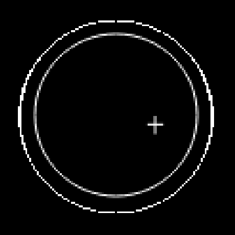
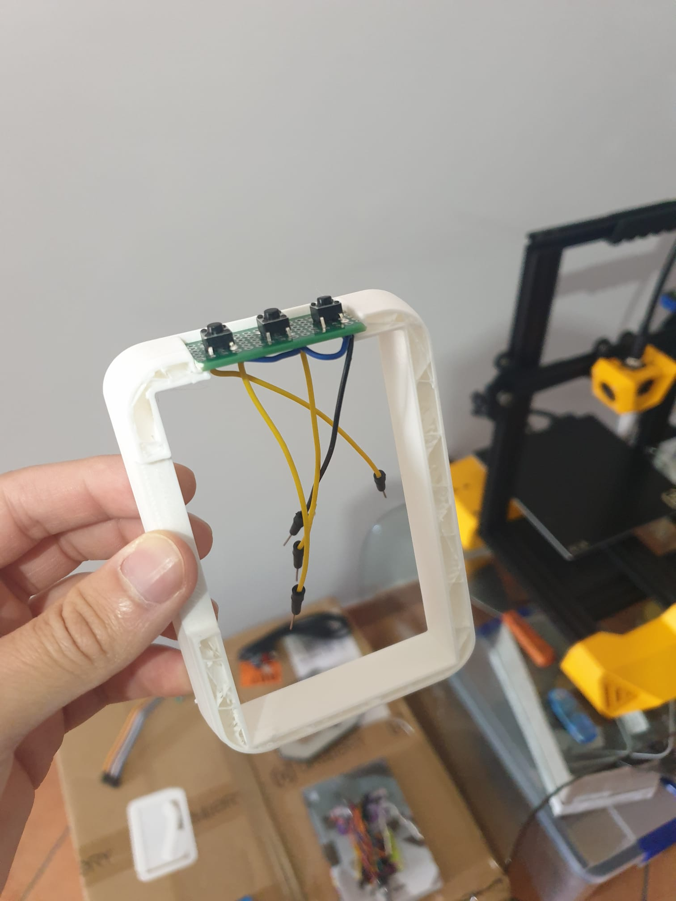
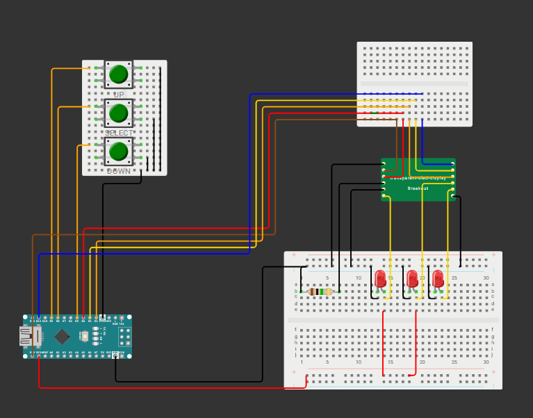

# SmartGlasses
Simple prototype of AR glasses inspired to Dragon Ball scouter and powered by Esp32 - cam and YOLO11

## Requirements

- hardware
    - [ESP32-S3 WROOM N16R8 CAM](https://it.aliexpress.com/item/1005007308040075.html?spm=a2g0o.order_list.order_list_main.5.2b491802v3YoHy&gatewayAdapt=glo2ita)
    - [Arduino Nano 3.0](https://it.aliexpress.com/item/1005008505441191.html?spm=a2g0o.order_list.order_list_main.10.2b491802v3YoHy&gatewayAdapt=glo2ita)
    - [Transparent OLED Display](https://it.aliexpress.com/item/1005007983700262.html?spm=a2g0o.order_list.order_list_main.45.2b491802v3YoHy&gatewayAdapt=glo2ita)
    - Your PC

- software requirements
    - [ultralitics yolo11](https://docs.ultralytics.com/quickstart/)
    - [ArduinoJson](https://arduinojson.org/v6/doc/installation/)
    - [U8g2lib](https://github.com/olikraus/u8g2/wiki/u8g2install)

## how it works

<strong>Pipeline</strong>

The sistem uses 3 distict elements to work, the ESP32 who capture the image and coordinate all the operations, the pc who process the image recevived by the esp32 using the yolo11 model and pacs the information about the received object for a easier use in the rest of the pipeline and the arduino nano that takes the info received and display it in the trasparent dispaly.

<strong>Interface</strong>

The information about the detected object is shown on the trasparent screeen, is possible to visualize the information in two different format:
- the **count view** that show the selected object category and the number of occorrence 
- the **radar view** that show the position of the detected objects for the selected category

In order to create the radar view the detected position are first converted to the size of the screen, then to add the arrow effect the distance from the center of the screen is calculated, if the resulting distance is greeater than a certain tresholde the position are scomposed to sin and cos respect a reference sistem positioned in the center of the screen, this are used to find the angle at wich dispaly the arrow

Two of the buttons on the device are used to go back and forth betwen the category and the other to swithch betwen the views

## Wiring

For detailed wiring of the display board, refer to the [official screen documentation](https://surenoo.tech/download/03_SOL/0302_SOG/SOG128128A_T112.pdf?spm=a2g0o.detail.1000023.30.7a4b2DLo2DLomk&file=SOG128128A_T112.pdf) (note: the LEDs in the schematic represent 10㎌ 50V capacitors).

To complete the circuit, establish serial communication between the Arduino and ESP32:
- Connect the grounds between the two boards
- Connect RX to TX (pin 6 on Arduino, pin 1 on ESP32)
- Connect TX to RX (pin 7 on Arduino, pin 3 on ESP32)

## 3D print

All the components are contained in a case to emulate the famus Scouter from Dragon Ball Z, to reproduce it I started from [this model 3D model](https://www.thingiverse.com/thing:2853831) that i found online and edited it in fusion 360 to make room for all the components. The result models are contained in the folder [glasses_assets/3D model](./glasses_assets/3D%20model/)

- [Asta.stl](./glasses_assets/3D%20model/Asta.stl) that holds the trasparent dispaly and the ESP32
- [Coperchio.stl](./glasses_assets/3D%20model/Coperchio.stl) that contains the Arduino Nano and the display board
- [Padiglione.stl](./glasses_assets/3D%20model/Padiglione.stl) that holds the buttons

